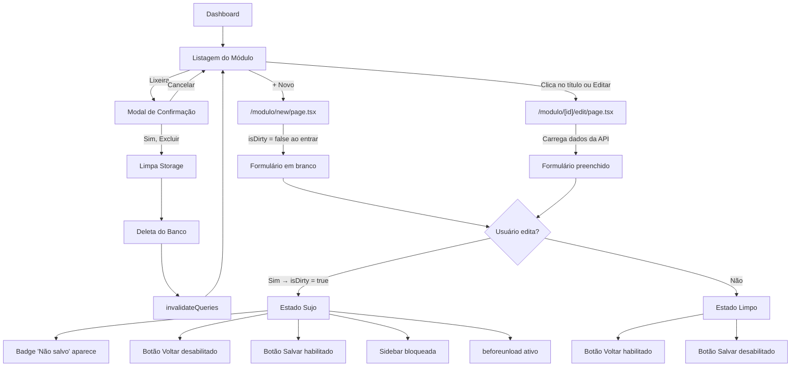
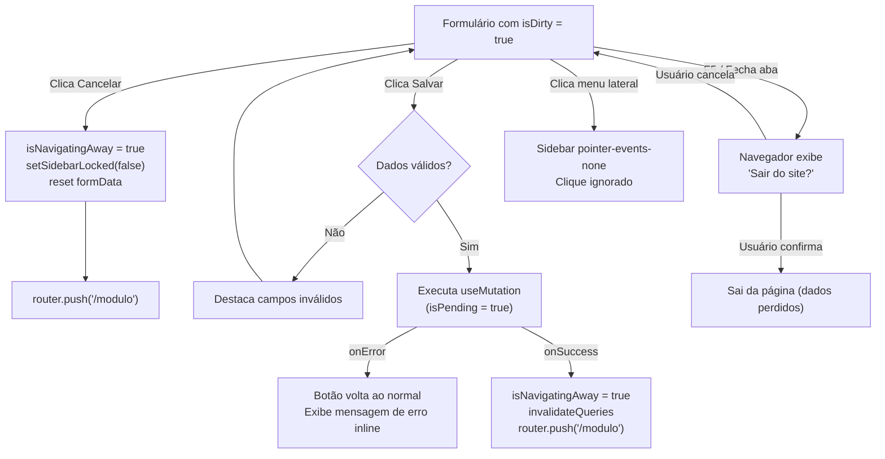
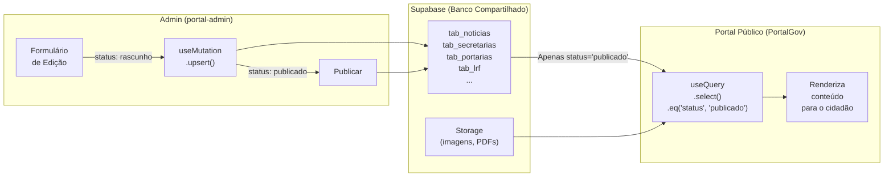

# Padrão V4 Elite — Especificação do Painel Administrativo

> **Single Source of Truth** para o painel administrativo do ecossistema PortalGov.
> Todo desenvolvedor humano ou agente de IA deve ler este documento **antes de escrever qualquer linha de código** de interface administrativa.

---

## 🗺️ Contexto do Ecossistema

> ⚠️ **Escopo deste documento:** O Padrão V4 Elite cobre **exclusivamente o painel administrativo** (área com login/autenticação). O frontend público do PortalGov segue um design system próprio (Professional 2.0) documentado separadamente em `Projeto PortalGov/docs/MASTER-SYSTEM-BLUEPRINT.md`.

O ecossistema possui **dois projetos Next.js que compartilham o mesmo banco Supabase**:

| Projeto | Pasta | Quem usa | O que faz |
| :--- | :--- | :--- | :--- |
| **Portal Admin (atual)** | `ExtracaoDadosPortalWeb_V2/portal-admin` | Administradores | CRUD completo: Notícias, Secretarias, Portarias, LRF, Gestores, PCG |
| **PortalGov Admin (futuro)** | `Projeto PortalGov/src/app/admin/` | Admins do portal público | Gerenciar conteúdo exibido no portal municipal — **usa exatamente este mesmo Padrão V4 Elite** |

**Regra de banco compartilhado:** O Admin **escreve** dados com `status = 'rascunho' | 'publicado'`. O portal público **lê** apenas `status = 'publicado'` via queries filtradas.

---

## Parte 1 — Painel Administrativo (Admin Dashboard)

### 1.1 Estrutura de Rotas do Admin

```
/app/(admin)/
  dashboard/          # Tela inicial com métricas e atalhos
  noticias/
    page.tsx          # Listagem com tabela + bulk actions
    new/page.tsx      # Formulário de criação
    [id]/edit/page.tsx # Formulário de edição
  secretarias/        # Mesma estrutura (list / new / [id]/edit)
  gestores/
  portarias/
  lrf/
  pcg/
```

**Regra:** Todo módulo CRUD segue a convenção de rota `listar → criar → editar`. Nunca use modais para formulários complexos.

---

### 1.2 Layout Geral da Página de Edição / Criação (CRUD)

Toda página de formulário (`[id]/edit/page.tsx` ou `new/page.tsx`) deve seguir obrigatoriamente a estrutura **Dual-Column** para telas grandes, com um **Cabeçalho Sticky** no topo.

**Container Principal:**
```tsx
<div className="flex flex-col h-full bg-bg-main">
  {/* Cabeçalho Sticky */}
  {/* Corpo / Grid 2-Colunas */}
</div>
```

---

### 1.3 Cabeçalho Sticky (Header do Formulário)

O cabeçalho deve flutuar sobre o conteúdo quando a página rolar, mantendo as ações sempre visíveis.

**Classes obrigatórias:**
```tsx
<header className="sticky top-0 z-[100] px-8 py-4 bg-white/90 backdrop-blur-md flex items-center justify-between border-b border-border-color mb-6 mx-[-32px] mt-[-32px] shadow-sm">
```

**Composição do Header:**

**Lado Esquerdo:**
- Botão Voltar (`ArrowLeft` de `lucide-react`) — discreto, sem fundo, hover suave `bg-slate-100`.
- Título da página (`h2`, `text-xl font-black text-slate-900 tracking-tight`).
- Subtítulo com o ID do registro (`text-[11px] font-bold text-slate-400 uppercase`).
- Badge condicional "Não salvo" (visível apenas quando `isDirty === true`):
  ```tsx
  {isDirty && (
    <span className="text-[10px] font-bold px-2 py-0.5 rounded-full bg-amber-100 text-amber-700 border border-amber-200">
      Não salvo
    </span>
  )}
  ```

**Lado Direito (Ações):**
- Separador visual: `<div className="w-px h-6 bg-slate-200 mx-1" />`
- **Botão Cancelar:** `border-slate-200 text-slate-500 hover:bg-slate-50 rounded-xl`
- **Botão Salvar:** `bg-[#004c99] hover:bg-[#003366] text-white shadow-lg shadow-blue-100 rounded-xl`
- Estado de loading: desabilita o botão e altera o texto para "Salvando..."

---

### 1.4 Grid Dual-Column (Corpo do Formulário)

O formulário é dividido em proporção 2:1 (`lg:grid-cols-3`):
- **Coluna Principal (esquerda):** `lg:col-span-2` — Dados primários (Nome, Descrição, Textos Ricos, Arquivos PDF).
- **Coluna Lateral (direita):** `lg:col-span-1` — Metadados (Status, Datas, IDs, Upload de imagem, Zona de exclusão).

**Card container padrão (ambas as colunas):**
```tsx
<div className="bg-white border border-border-color rounded-xl p-6 shadow-[0_1px_3px_rgba(0,0,0,0.05)] flex flex-col gap-5">
```

---

### 1.5 Campos de Formulário e Inputs

**Inputs / Selects / Textareas:**
```tsx
className="w-full bg-white border border-border-color rounded-md px-3 py-2 text-[14px] text-text-primary outline-none focus:border-city-hall-accent focus:ring-2 focus:ring-city-hall-accent/50 transition-colors"
```
*(Para campos `disabled`, adicione `disabled:bg-slate-50 disabled:text-slate-400`.)*

**Labels:**
```tsx
<label className="text-[13px] font-semibold text-slate-700 flex items-center gap-2">
  <IconName size={14} className="text-city-hall-blue" /> Nome do Campo
</label>
```

**Navegação de teclado:** Todo formulário deve escutar `Enter` para pular ao próximo campo (não submeter). Implemente via `handleKeyDown` no `onKeyDown` dos inputs.

---

### 1.6 Upload de Imagens / PDFs

**Imagens** ficam na Coluna Lateral em um quadrado `aspect-square` com borda tracejada:
```tsx
<div className="aspect-square w-full max-w-[300px] mx-auto rounded-xl border-2 border-dashed border-slate-300 flex flex-col items-center justify-center gap-2 bg-slate-50 hover:border-city-hall-accent hover:bg-blue-50/50 transition-all cursor-pointer group overflow-hidden relative shadow-inner">
```
- Se a imagem existir: ``
- Botões de apoio logo abaixo: "Trocar Foto" e lixeira "Excluir Foto".

**PDFs** (módulos LRF, PCG, Portarias) ficam na Coluna Principal como tabela gerenciável com colunas: Nome do arquivo, Tipo, Data, Ações (Download / Excluir).

---

### 1.7 Ação de Exclusão (Delete)

A ação de excluir deve ficar de forma **elegante e discreta** no rodapé da Coluna Lateral. Nunca use blocos isolados com fundos vermelhos grandes.

```tsx
<div className="pt-4 border-t border-border-color">
  {/* Exibição do ID do registro */}
  <button
    onClick={handleDelete}
    className="w-full py-2.5 rounded-md border border-red-200 text-red-600 text-[13px] font-semibold hover:bg-red-50 transition-colors flex items-center justify-center gap-2"
  >
    <Trash2 size={15} /> Excluir Registro
  </button>
</div>
```

**Obrigatório:** Ao excluir um registro que possui arquivos no Supabase Storage (`foto_url`, `arquivo_url`, `anexos`), busque as URLs **antes** de deletar o registro e execute `supabaseAdmin.storage.from(...).remove(paths)` logo após.

---

### 1.8 Resumo de Cores (Tailwind Config)

| Token | Valor |
| :--- | :--- |
| `bg-bg-main` | Fundo principal do dashboard |
| `text-city-hall-blue` / `border-city-hall-accent` | Acentos azuis |
| `bg-[#004c99]` | Botão primário "Salvar" |
| `border-border-color` | Bordas padrão de cards e inputs |
| `text-text-primary` | Texto base |

---

## Parte 2 — Fluxo de Edição e Proteção de Dados (isDirty)

> Esta é a regra mais importante de UX do painel. Deve ser replicada **sem exceções** em todas as páginas de formulário.

### 2.1 Tabela de Comportamento por Ação

| Ação do Usuário | Condição | Comportamento do Sistema |
| :--- | :--- | :--- |
| **Entrar na tela** | `isDirty = false` | Formulário espelha o banco. Botão "Salvar" desabilitado. |
| **Alterar qualquer campo** | `isDirty → true` | Badge "Não salvo" aparece. Seta Voltar fica desabilitada. Botão Salvar acende. |
| **Clicar na Seta Voltar** | `isDirty === true` | **Bloqueado.** O botão não reage (`disabled`). |
| **Clicar na Seta Voltar** | `isDirty === false` | Navega normalmente para a listagem. |
| **Clicar em Cancelar** | Sempre ativo | Define `isNavigatingAway = true`, descarta alterações, chama `router.push('/modulo')`. |
| **Clicar em Salvar** | Após validação | Executa a mutação. Em `onSuccess`: define `isNavigatingAway = true`, invalida cache e chama `router.push('/modulo')`. Sem `alert()`. |
| **Tentar Fechar Aba / F5** | `isDirty === true` | Listener `beforeunload` exibe diálogo nativo do navegador. |
| **Clicar no Menu Lateral** | Rotas `/edit` ou `/new` | Sidebar detecta a rota e aplica `pointer-events-none` em todo o menu. |

### 2.2 Implementação: Rastreamento de `isDirty`

**Formulários simples** (campos escalares): acionar `setIsDirty(true)` no `onChange` de cada input.

**Formulários complexos** (objetos aninhados, arrays — LRF, Notícias): usar comparação via `JSON.stringify` em um `useEffect`:
```tsx
const initialDataStr = useRef('');

// Ao carregar dados da API:
initialDataStr.current = JSON.stringify(data);

// Detectar mudanças:
useEffect(() => {
  if (!initialDataStr.current) return;
  const currentStr = JSON.stringify(formData);
  setIsDirty(currentStr !== initialDataStr.current);
}, [formData]);
```

### 2.3 Implementação: Proteção de Navegação

```tsx
const isNavigatingAway = useRef(false);

// Proteção de aba/F5:
useEffect(() => {
  const handler = (e: BeforeUnloadEvent) => {
    if (isDirty && !isNavigatingAway.current) {
      e.preventDefault();
      e.returnValue = '';
    }
  };
  window.addEventListener('beforeunload', handler);
  return () => window.removeEventListener('beforeunload', handler);
}, [isDirty]);

// Em handleCancel:
const handleCancel = () => {
  isNavigatingAway.current = true;
  setSidebarLocked(false);
  router.push('/modulo');
};

// Em onSuccess da mutation:
onSuccess: () => {
  isNavigatingAway.current = true;
  queryClient.invalidateQueries({ queryKey: ['modulo'] });
  router.push('/modulo');
}
```

---

## Parte 3 — Admin do PortalGov (Reutilização do Padrão V4 Elite)

> O projeto `Projeto PortalGov` terá um painel admin próprio em `/admin`. Esse admin **deve seguir exatamente o mesmo Padrão V4 Elite** descrito neste documento. Não existe um design system diferente para ele.

### 3.1 Onde Fica o Admin no PortalGov

```
Projeto PortalGov/
  src/
    app/
      [tenant]/          # Frontend público (sem login — design próprio)
      admin/             # ← Painel Admin (com login — Padrão V4 Elite)
        layout.tsx       # Layout com Sidebar + Header do admin
        dashboard/
        noticias/
          page.tsx       # Listagem (padrão Parte 7)
          new/page.tsx   # Criação (padrão Parte 1)
          [id]/edit/page.tsx  # Edição (padrão Parte 1 + 2)
        secretarias/
        portarias/
        lrf/
        gestores/
```

### 3.2 O que é IGUAL ao Portal Admin atual

Tudo que está nas Partes 1, 2, 4, 5, 6, 7 e 8 deste documento se aplica **sem modificação** ao admin do PortalGov:

| Elemento | Reuso |
| :--- | :--- |
| Header Sticky com isDirty | ✅ Idêntico |
| Grid Dual-Column | ✅ Idêntico |
| Fluxo isDirty / isNavigatingAway | ✅ Idêntico |
| Sidebar com bloqueio em `/edit` e `/new` | ✅ Idêntico |
| Modal de Confirmação de Exclusão | ✅ Idêntico |
| Tabela com Bulk Actions e Paginação | ✅ Idêntico |
| Autenticação Supabase Auth | ✅ Idêntico |
| RBAC (perfis e permissões) | ✅ Idêntico |
| Paleta de cores (`#004c99`, `border-color`, etc.) | ✅ Idêntico |

### 3.3 O que é DIFERENTE no Admin do PortalGov

| Aspecto | Portal Admin (atual) | Admin do PortalGov |
| :--- | :--- | :--- |
| **Banco de dados** | Tabelas da extração (`tab_noticias`, `tab_secretarias`, etc.) | As mesmas tabelas — banco compartilhado |
| **Contexto de tenant** | Seleção manual de município no header | Resolvido pelo slug da URL (`/aracati/admin`) ou configuração do usuário logado |
| **Módulos disponíveis** | Scraper, AI Generator, Configurações | Gerenciamento de conteúdo do portal público (Notícias, Secretarias, Portarias, LRF) |
| **Integração futura** | Extração de dados automática | Editor visual de seções da home pública (hero, destaques) |

### 3.4 Autenticação (Login do Admin do PortalGov)

O painel admin **exige autenticação**. O frontend público (`/[tenant]`) é aberto sem login.

```
URL pública (sem login):  /aracati
URL admin (com login):    /aracati/admin  ou  /admin
```

**Fluxo de autenticação:**
- Supabase Auth (email/senha ou magic link)
- Middleware Next.js protege todas as rotas `/admin/**`
- Ao acessar qualquer rota admin sem sessão → redireciona para `/admin/login`
- Após login → redireciona para `/admin/dashboard`

**Página de login:** Tela centralizada, limpa, com logo do município, campo de e-mail e senha. **Sem** a Sidebar ou o header do dashboard. Botão primário com o padrão `bg-[#004c99]`.

### 3.5 Módulos do Admin do PortalGov (Roadmap)

| Módulo | Tabela Supabase | Status |
| :--- | :--- | :--- |
| Notícias | `tab_noticias` | Banco já populado pelo scraper |
| Secretarias | `tab_secretarias` | Banco já populado pelo scraper |
| Portarias | `tab_portarias` | Banco já populado pelo scraper |
| LRF (Documentos fiscais) | `tab_lrf` | Banco já populado pelo scraper |
| Gestores | `tab_gestores` | Banco já populado pelo scraper |
| Configurações do Município | `tab_municipios` | A criar |
| Usuários do Admin | `auth.users` + `tab_perfis` | A criar |

---

## Parte 4 — Banco de Dados Compartilhado (Supabase)

### 4.1 Tabelas Principais e Campos de Controle

Toda tabela de conteúdo gerenciável deve ter os campos abaixo além de seus dados específicos:

| Campo | Tipo | Descrição |
| :--- | :--- | :--- |
| `id` | `uuid` | Chave primária (gerada pelo Supabase) |
| `tenant_slug` | `text` | Identificador do município (ex: `"aracati"`) |
| `status` | `text` | `'rascunho'` ou `'publicado'` |
| `created_at` | `timestamptz` | Data de criação (automático) |
| `updated_at` | `timestamptz` | Data de última edição (automático via trigger) |
| `created_by` | `uuid` | FK para `auth.users` — quem criou |

### 4.2 Regra de Leitura (Portal Público)

```ts
// SEMPRE filtrar por status publicado e pelo tenant
const { data } = await supabase
  .from('noticias')
  .select('*')
  .eq('tenant_slug', tenantSlug)
  .eq('status', 'publicado')
  .order('created_at', { ascending: false });
```

### 4.3 Invalidação de Cache (React Query — Admin)

Após toda mutação (create, update, delete), invalidar a query da listagem:
```ts
queryClient.invalidateQueries({ queryKey: ['noticias', tenantSlug] });
```

### 4.4 Segurança de Storage (Supabase Storage)

**Obrigatório:** Ao excluir um registro, deletar também os arquivos associados:
```ts
// 1. Buscar URLs antes de deletar o registro
const record = await supabase.from('tabela').select('foto_url, arquivo_url').eq('id', id).single();

// 2. Extrair os paths de storage (remover domínio base)
const paths = [record.foto_url, record.arquivo_url]
  .filter(Boolean)
  .map(url => url.split('/storage/v1/object/public/bucket/')[1]);

// 3. Deletar do storage
await supabaseAdmin.storage.from('bucket').remove(paths);

// 4. Deletar o registro
await supabase.from('tabela').delete().eq('id', id);
```

---

## Parte 5 — Controle de Acesso (RBAC)

O sistema usa controle de acesso granular por ação e módulo.

### 5.1 Perfis de Usuário do Admin

| Perfil | Acesso |
| :--- | :--- |
| `super_admin` | Acesso total a todos os tenants |
| `admin_municipal` | Acesso total ao seu tenant |
| `editor` | Criar e editar (não pode publicar nem excluir) |
| `revisor` | Somente visualizar e publicar/despublicar |

### 5.2 Granularidade de Permissões

Cada módulo (Notícias, Secretarias, Portarias, LRF, Gestores, PCG) suporta as ações:
- `criar` — Acessar `/new` e salvar
- `editar` — Acessar `/[id]/edit` e salvar
- `publicar` — Alterar `status` de `rascunho` para `publicado`
- `excluir` — Botão de exclusão visível e funcional

**Regra de UI:** Se o usuário não tiver a permissão de uma ação, o botão correspondente deve ficar oculto (`hidden`) ou desabilitado com tooltip explicativo — nunca exibir erro só após o clique.

---

## Parte 6 — Regras de Ouro (Inegociáveis)

| # | Regra |
| :--- | :--- |
| 1 | **Nunca use emojis como ícones de interface.** Use exclusivamente Lucide SVG. |
| 2 | **Nunca use `alert()` ou `confirm()` para feedback.** Use estados de UI, badges e toasts. |
| 3 | **Todo card ou elemento clicável DEVE ter `cursor-pointer`.** |
| 4 | **Nunca hardcode dados de município.** Todo conteúdo vem via `TenantConfig` ou do banco. |
| 5 | **O teto tipográfico do portal público é `text-5xl`.** Acima disso é errado. |
| 6 | **Acessibilidade WCAG AA:** Manter contraste mínimo de 4.5:1 em todos os textos. |
| 7 | **Todo botão com ação assíncrona deve ter estado de loading** (`disabled + "Salvando..."`). |
| 8 | **O fluxo isDirty é obrigatório em toda tela de edição do Admin.** Sem exceção. |
| 9 | **Ao excluir registros com arquivos, limpar o Storage antes de deletar o banco.** |
| 10 | **Nunca use `transition: all`.** Liste propriedades explicitamente no Tailwind/CSS. |

---

## Parte 7 — Padrão da Tela de Listagem (Admin)

A tela de listagem (`page.tsx` raiz do módulo) é a âncora do fluxo CRUD. Ela deve ser **rápida, filtrável e acionável sem modais**.

### 7.1 Estrutura Visual da Listagem

```
┌─────────────────────────────────────────────────────────────┐
│  Page Header: [Título + Subtítulo]     [Atualizar] [+ Novo] │
├─────────────────────────────────────────────────────────────┤
│  Status Tabs: Todos(N) | Publicado(N) | Rascunho(N) | ...  │  ← borda-bottom ativa
│                                         [Tabela] [Cards]    │
├─────────────────────────────────────────────────────────────┤
│  [🔍 Buscar...]  [Categoria ▼]  [Ações em Lote ▼]  N ITENS │
├─────────────────────────────────────────────────────────────┤
│  ┌── DataTable / Cards Grid ──────────────────────────────┐  │
│  │  ☐ | CAPA | TÍTULO / IDENTIFICAÇÃO | DATA | STATUS | ⚙ │  │
│  │  ─────────────────────────────────────────────────────  │  │
│  │  ☐ | 🖼  | Título da notícia...    | 01/05 | Publicado │  │
│  └────────────────────────────────────────────────────────┘  │
├─────────────────────────────────────────────────────────────┤
│  Página 1 de 8 • Total de 152 registros    [‹] [›]          │
└─────────────────────────────────────────────────────────────┘
```

### 7.2 Page Header da Listagem

```tsx
<div className="flex items-center justify-between">
  <div>
    <h1 className="text-[22px] font-black text-slate-900 leading-tight tracking-tight">
      {/* Nome do Módulo */}
    </h1>
    <p className="text-slate-500 text-[13px] font-medium">
      Gerencie as {módulo} do portal de {currentMunicipality?.name}
    </p>
  </div>
  <div className="flex items-center gap-3">
    {/* Botão Atualizar */}
    <button className="h-9 px-3 rounded-xl border border-slate-200 bg-white text-slate-600 text-[12px] font-bold hover:bg-slate-50 transition-all flex items-center gap-2">
      <RefreshCw size={16} /> Atualizar
    </button>
    {/* Botão Novo (primário) */}
    <button className="h-9 px-4 rounded-xl bg-[#004c99] text-white text-[13px] font-bold hover:bg-[#003366] transition-all flex items-center gap-2 shadow-lg shadow-blue-100">
      <Plus size={16} /> Novo {Registro}
    </button>
  </div>
</div>
```

### 7.3 Status Tabs com Contadores Dinâmicos

- Os contadores (`Todos`, `Publicado`, `Rascunho`, `Arquivado`) devem vir de **uma única query de contagem** (endpoint `/api/admin/{modulo}/counts`), não de 4 queries separadas.
- Tab ativa: `text-[#004c99] border-[#004c99] border-b-2 -mb-[1px]`
- Tab inativa: `text-slate-400 border-transparent hover:text-slate-600`

### 7.4 Barra de Busca e Filtros

- Campo de busca: largura máxima `max-w-[320px]`, ícone `Search` à esquerda, foco com `ring-4 ring-blue-50`.
- Filtros adicionais: `<select>` com estilo `h-9 px-3 bg-white border border-slate-200 rounded-xl`.
- Ao alterar qualquer filtro ou busca: **resetar `page` para `0`**.

### 7.5 Coluna de Ações da Tabela (por linha)

```tsx
// Botões inline da linha — visíveis sempre, feedback no hover
<div className="flex items-center justify-end gap-1">
  <button
    onClick={() => router.push(`/modulo/${row.id}/edit`)}
    className="p-1.5 text-slate-500 hover:text-[#004c99] hover:bg-blue-50 rounded-md transition-colors border border-transparent hover:border-blue-200"
    title="Editar"
  >
    <Pencil size={16} />
  </button>
  <button
    onClick={() => setConfirmDelete(row.id)}
    className="p-1.5 text-slate-500 hover:text-red-500 hover:bg-red-50 rounded-md transition-colors border border-transparent hover:border-red-200"
    title="Excluir"
  >
    <Trash2 size={16} />
  </button>
</div>
```

### 7.6 Modal de Confirmação de Exclusão

**Nunca** use `window.confirm()`. Use um modal próprio com Framer Motion:

```tsx
// Estrutura do Modal de Confirmação
<div className="fixed inset-0 bg-slate-900/40 backdrop-blur-md z-[100] flex items-center justify-center p-6">
  <motion.div
    initial={{ opacity: 0, scale: 0.9 }}
    animate={{ opacity: 1, scale: 1 }}
    exit={{ opacity: 0, scale: 0.9 }}
    className="bg-white rounded-[32px] p-10 max-w-md w-full shadow-2xl border border-slate-100"
  >
    {/* Ícone de perigo */}
    <div className="w-16 h-16 rounded-2xl bg-red-50 text-red-500 flex items-center justify-center mb-6">
      <Trash2 size={32} />
    </div>
    <h3 className="text-2xl font-black text-slate-900 mb-2">Confirmar Exclusão</h3>
    {/* Texto descritivo + botões Cancelar / Sim, Excluir */}
  </motion.div>
</div>
```

### 7.7 Modo de Visualização (Tabela / Cards)

Todos os módulos devem oferecer alternância entre os dois modos:
- **Tabela:** `DataTableV2` com checkbox de seleção, ordenação por coluna e paginação.
- **Cards:** Grid responsivo (`grid-cols-1 sm:grid-cols-2 lg:grid-cols-3 xl:grid-cols-4`). Cards com `whileHover={{ y: -4 }}` do Framer Motion. Botões de ação aparecem com `opacity-0 group-hover:opacity-100`.

**Toggle de modo:**
```tsx
<div className="flex items-center bg-slate-100 p-1 rounded-xl">
  <button className={`px-3 py-1.5 rounded-lg text-[12px] font-bold transition-all ${viewMode === 'table' ? 'bg-white text-[#004c99] shadow-sm' : 'text-slate-500'}`}>
    <TableIcon size={14} /> Tabela
  </button>
  <button className={`px-3 py-1.5 rounded-lg text-[12px] font-bold transition-all ${viewMode === 'cards' ? 'bg-white text-[#004c99] shadow-sm' : 'text-slate-500'}`}>
    <LayoutGrid size={14} /> Cards
  </button>
</div>
```

### 7.8 Ações em Lote (Bulk Actions)

O componente `<BulkActionDropdown>` é ativado quando `selectedIds.length > 0`. Ações disponíveis:
- Publicar Selecionados → `status: 'publicado'` (ícone `Globe`, cor `text-emerald-500`)
- Mover para Rascunho → `status: 'rascunho'` (ícone `Pencil`, cor `text-amber-500`)
- Arquivar Selecionados → `status: 'arquivado'` (ícone `HardDrive`, cor `text-slate-400`)
- `SEPARATOR` (divisor visual)
- Excluir Selecionados → abre modal de confirmação (variante `danger`)

### 7.9 Paginação

```tsx
// Rodapé da tabela — visível apenas quando totalPages > 1
<div className="px-8 py-5 border-t border-slate-100 bg-slate-50/50 flex items-center justify-between">
  <div className="text-[12px] font-bold text-slate-400 uppercase tracking-wider">
    Página {page + 1} de {totalPages} • Total de {totalItems} registros
  </div>
  <div className="flex items-center gap-2">
    <button onClick={() => setPage(p => Math.max(0, p - 1))} disabled={page === 0}
      className="w-10 h-10 rounded-xl border border-slate-200 bg-white flex items-center justify-center hover:bg-slate-50 disabled:opacity-30">
      <ChevronLeft size={20} />
    </button>
    <button onClick={() => setPage(p => Math.min(totalPages - 1, p + 1))} disabled={page >= totalPages - 1}
      className="w-10 h-10 rounded-xl border border-slate-200 bg-white flex items-center justify-center hover:bg-slate-50 disabled:opacity-30">
      <ChevronRight size={20} />
    </button>
  </div>
</div>
```

---

## Parte 8 — Diagramas de Fluxo Completos

### 8.1 Fluxo Geral de Navegação (Admin)



### 8.2 Fluxo de Saída da Tela de Edição



### 8.3 Fluxo de Dados: Admin ↔ Supabase ↔ Portal Público



---

## Referência Rápida: Arquivos Modelo

> 💡 **Admin — Listagem:** `portal-admin/src/app/(admin)/noticias/page.tsx`
> Referência canônica para telas de listagem com tabela, filtros, bulk actions e paginação.

> 💡 **Admin — Edição:** `portal-admin/src/app/(admin)/secretarias/[id]/edit/page.tsx`
> Referência canônica para formulários dual-column, fluxo isDirty e header sticky.

> 💡 **Portal Público:** `Projeto PortalGov/src/app/[tenant]/page.tsx`
> Referência canônica para composição de seções, multi-tenancy e design Professional 2.0.
